# Fork from [ htpc-download-box by sebgl ](https://github.com/sebgl/htpc-download-box)

# HTPC Download Box

Sonarr / Radarr / Jackett / NZBGet / Deluge / OpenVPN / Plex

TV shows and movies download, sort, with the desired quality and subtitles, behind a VPN (optional), ready to watch, in a beautiful media player.
All automated.

## Table of Contents

- [HTPC Download Box](#htpc-download-box)
  - [Table of Contents](#table-of-contents)
  - [Overview](#overview)
    - [Monitor TV shows/movies with Sonarr and Radarr](#monitor-tv-showsmovies-with-sonarr-and-radarr)
    - [Search for releases automatically with Usenet and torrent indexers](#search-for-releases-automatically-with-usenet-and-torrent-indexers)
    - [Handle bittorrent and usenet downloads with Deluge and NZBGet](#handle-bittorrent-and-usenet-downloads-with-deluge-and-nzbget)
    - [Organize libraries and play videos with Plex](#organize-libraries-and-play-videos-with-plex)
  - [Hardware configuration](#hardware-configuration)
  - [Software stack](#software-stack)
  - [Installation guide](#installation-guide)
    - [Introduction](#introduction)
    - [Install docker and docker-compose](#install-docker-and-docker-compose)
    - [Setup Deluge](#setup-deluge)
      - [Docker container](#docker-container)
      - [Configuration](#configuration)
    - [Setup Jackett](#setup-jackett)
      - [Docker container](#docker-container-2)
      - [Configuration and usage](#configuration-and-usage)
    - [Setup NZBGet](#setup-nzbget)
      - [Docker container](#docker-container-3)
      - [Configuration and usage](#configuration-and-usage)
    - [Setup Sonarr](#setup-sonarr)
      - [Docker container](#docker-container-4)
      - [Configuration](#configuration-2)
      - [Give it a try](#give-it-a-try)
    - [Setup Radarr](#setup-radarr)
      - [Docker container](#docker-container-5)
      - [Configuration](#configuration-3)
      - [Give it a try](#give-it-a-try-1)
      - [Movie discovering](#movie-discovering)
    - [Setup Bazarr](#setup-bazarr)
      - [Bazarr Docker container](#bazarr-docker-container)
      - [Bazarr Configuration](#bazarr-configuration)
  - [Manage it all from your mobile](#manage-it-all-from-your-mobile)
  - [Going Further](#going-further)

## Overview

This is what I have set up at home to handle TV shows and movies automated download, sort and play.

_Disclaimer: I'm not encouraging/supporting piracy, this is for information purpose only._

How does it work? I rely on several tools integrated together. They're all open-source, and deployed as Docker containers on my Linux server.

The common workflow is detailed in this first section to give you an idea of how things work.

### Monitor TV shows/movies with Sonarr and Radarr

Using [Sonarr](https://sonarr.tv/) Web UI, search for a TV show by name and mark it as monitored. You can specify a language and the required quality (1080p for instance). Sonarr will automatically take care of analyzing existing episodes and seasons of this TV show. It compares what you have on disk with the TV show release schedule, and triggers download for missing episodes. It also takes care of upgrading your existing episodes if a better quality matching your criterias is available out there.

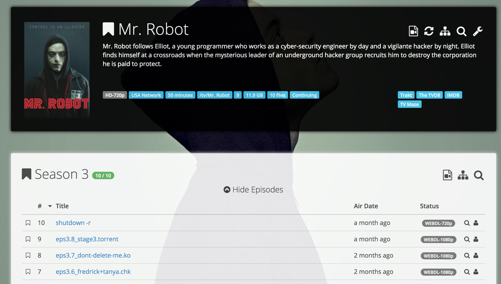
Sonarr triggers download batches for entire seasons. But it also handle upcoming episodes and seasons on-the-fly. No human intervention is required for all the episodes to be released from now on.

When the download is over, Sonarr moves the file to the appropriate location (`my-tv-shows/show-name/season-1/01-title.mp4`), and renames the file if needed.

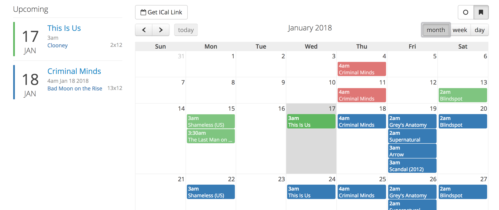

[Radarr](https://radarr.video) is the exact same thing, but for movies.

### Search for releases automatically with Usenet and torrent indexers

Sonarr and Radarr can both rely on two different ways to download files:

- Usenet (newsgroups) bin files. That's the historical and principal option, for several reasons: consistency and quality of the releases, download speed, indexers organization, etc. Often requires a paid subscription to newsgroup servers.
- Torrents. That's the new player in town, for which support has improved a lot lately.

I'm using both systems simultaneously, torrents being used only when a release is not found on newsgroups, or when the server is down. At some point I might switch to torrents only, which work really fine as well.

Files are searched automatically by Sonarr/Radarr through a list of _indexers_ that you have to configure. Indexers are APIs that allow searching for particular releases organized by categories. Think browsing the Pirate Bay programmatically. This is a pretty common feature for newsgroups indexers that respect a common API (called `Newznab`).
However this common protocol does not really exist for torrent indexers. That's why we'll be using another tool called [Jackett](https://github.com/Jackett/Jackett). You can consider it as a local proxy API for the most popular torrent indexers. It searches and parse information from heterogeneous websites.

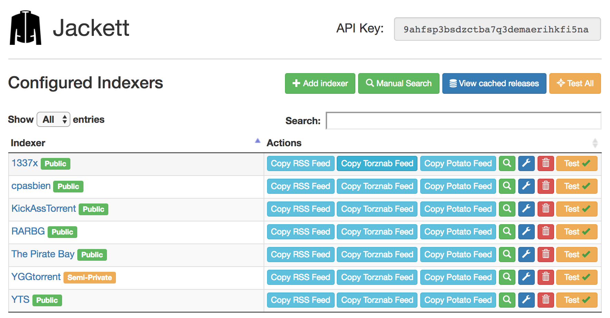

The best release matching your criteria is selected by Sonarr/Radarr (eg. non-blacklisted 1080p release with enough seeds). Then the download is passed on to another set of tools.

### Handle bittorrent and usenet downloads with Deluge and NZBGet

Sonarr and Radarr are plugged to downloaders for our 2 different systems:

- [NZBGet](https://nzbget.net/) handles Usenet (newsgroups) binary downloads.
- [Deluge](http://deluge-torrent.org/) handles torrent download.

Both are daemons coming with a nice Web UI, making them perfect candidates for being installed on a server. Sonarr & Radarr already have integration with them, meaning they rely on each service API to pass on downloads, request download status and handle finished downloads.

Both are very standard and popular tools. I'm using them for their integration with Sonarr/Radarr but also as standalone downloaders for everything else.

For security and anonymity reasons, I'm running Deluge behind a VPN connection. All incoming/outgoing traffic from deluge is encrypted and goes out to an external VPN server. Other service stay on my local network. This is done through Docker networking stack (more to come on the next paragraphs).


## Software stack

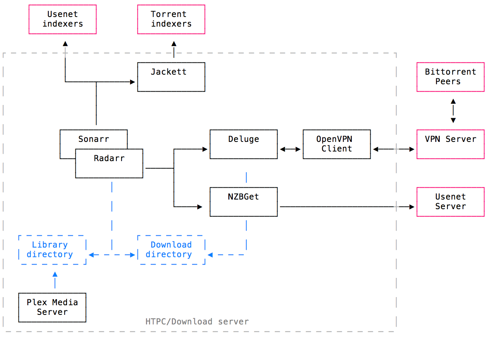

**Downloaders**:

- [Deluge](http://deluge-torrent.org): torrent downloader with a web UI
- [NZBGet](https://nzbget.net): usenet downloader with a web UI
- [Jackett](https://github.com/Jackett/Jackett): API to search torrents from multiple indexers
- [Bazarr](https://www.bazarr.media/): A companion tool for Radarr and Sonarr which will automatically pull subtitles for all of your TV and movie downloads.

**Download orchestration**:

- [Sonarr](https://sonarr.tv): manage TV show, automatic downloads, sort & rename
- [Radarr](https://radarr.video): basically the same as Sonarr, but for movies


## Installation guide

### Introduction

The idea is to set up all these components as Docker containers in a `docker-compose.yml` file.
We'll reuse community-maintained images (special thanks to [linuxserver.io](https://www.linuxserver.io/) for many of them).
I'm assuming you have some basic knowledge of Linux and Docker.
A general-purpose `docker-compose` file is maintained in this repo [here](https://github.com/sebgl/htpc-download-box/blob/master/docker-compose.yml).

The stack is not really plug-and-play. You'll see that manual human configuration is required for most of these tools. Configuration is not fully automated (yet?), but is persisted on reboot. Some steps also depend on external accounts that you need to set up yourself (usenet indexers, torrent indexers, vpn server, plex account, etc.). We'll walk through it.

Optional steps described below that you may wish to skip:

- Using a VPN server for Deluge incoming/outgoing traffic.
- Using newsgroups (Usenet): you can skip NZBGet installation and all related Sonarr/Radarr indexers configuration if you wish to use bittorrent only.

### Install docker and docker-compose

See the [official instructions](https://docs.docker.com/engine/installation/linux/docker-ce/ubuntu/#install-docker-ce-1) to install Docker.

Then add yourself to the `docker` group:
`sudo usermod -aG docker myuser`

Make sure it works fine:
`docker run hello-world`

Also install docker-compose (see the [official instructions](https://docs.docker.com/compose/install/#install-compose)).

### (optional) Use premade docker-compose

This tutorial will guide you along the full process of making your own docker-compose file and configuring every app within it, however, to prevent errors or to reduce your typing, you can also use the general-purpose docker-compose file provided in this repository.

1. First, `git clone https://github.com/sebgl/htpc-download-box` into a directory. This is where you will run the full setup from (note: this isn't the same as your media directory)
2. Rename the `.env.example` file included in the repo to `.env`.
3. Continue this guide, and the docker-compose file snippets you see are already ready for you to use. You'll still need to manually configure your `.env` file and other manual configurations.

### (optional) Use premade Vagrant box

You can also use a premade Vagrant box, that will spin up an Ubuntu virtual machine and bootstrap the environment from the `docker-compose` file described above.

After ensuring Vagrant is installed on your machine:

1. Run `vagrant up` to bootstrap the vagrant box
2. Run `vagrant ssh` to ssh into the box
3. Use the default `192.168.7.7` IP to access the box services from a local machine

### Setup environment variables

For each of these images, there is some unique configuration that needs to be done. Instead of editing the docker-compose file to hardcode these values in, we'll instead put these values in a .env file. A .env file is a file for storing environment variables that can later be accessed in a general-purpose docker-compose.yml file, like the example one in this repository.

Here is an example of what your `.env` file should look like, use values that fit for your own setup.

```sh
# Your timezone, https://en.wikipedia.org/wiki/List_of_tz_database_time_zones
TZ=America/New_York
PUID=1000
PGID=1000
# The directory where data and configuration will be stored.
ROOT=/media/my_user/storage/homemedia
```

Things to notice:

- TZ is based on your [tz time zone](https://en.wikipedia.org/wiki/List_of_tz_database_time_zones).
- The PUID and PGID are your user's ids. Find them with `id $USER`.
- This file should be in the same directory as your `docker-compose.yml` file so the values can be read in.

### Setup Deluge

#### Docker container

We'll use deluge Docker image from linuxserver, which runs both the deluge daemon and web UI in a single container.

```yaml
version: "3"
services:
  deluge:
    container_name: deluge
    image: linuxserver/deluge:latest
    restart: always
    network_mode: service:vpn # run on the vpn network
    environment:
      - PUID=${PUID} # default user id, defined in .env
      - PGID=${PGID} # default group id, defined in .env
      - TZ=${TZ} # timezone, defined in .env
    volumes:
      - ${ROOT}/downloads:/downloads # downloads folder
      - ${ROOT}/config/deluge:/config # config files
```

Things to notice:

- I use the host network to simplify configuration. Important ports are `8112` (web UI) and `58846` (bittorrent daemon).

Then run the container with `docker-compose up -d`.
To follow container logs, run `docker-compose logs -f deluge`.

#### Configuration

You should be able to login on the web UI (`localhost:8112`, replace `localhost` by your machine ip if needed).

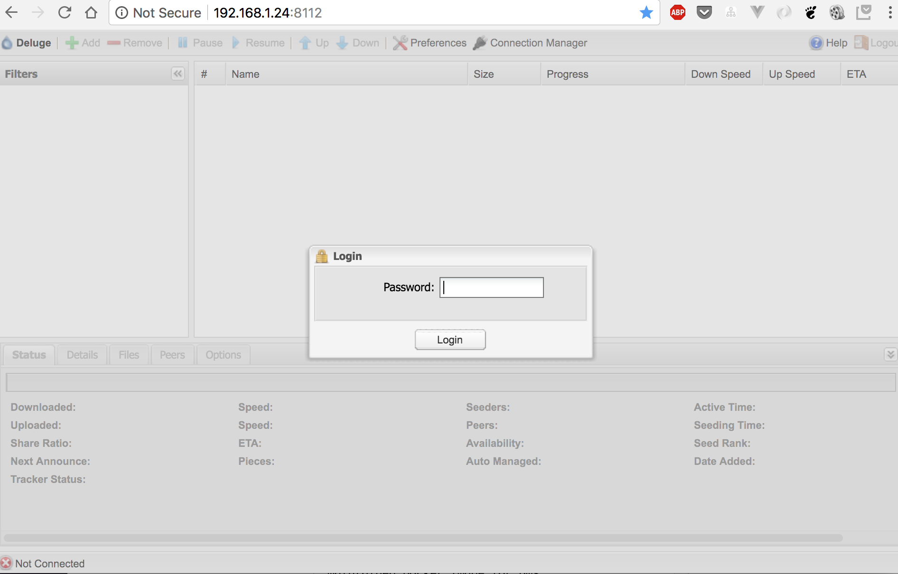

The default password is `deluge`. You are asked to modify it, I chose to set an empty one since deluge won't be accessible from outside my local network.

The running deluge daemon should be automatically detected and appear as online, you can connect to it.

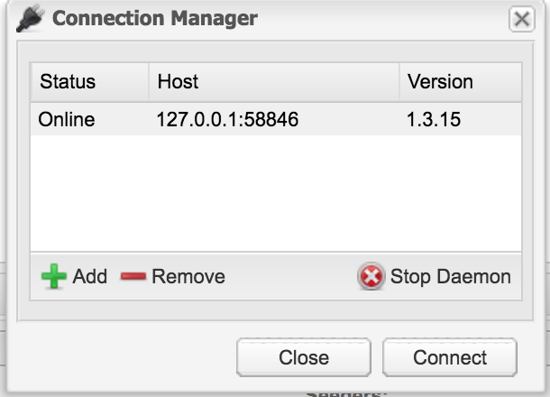

You may want to change the download directory. I like to have to distinct directories for incomplete (ongoing) downloads, and complete (finished) ones.
Also, I set up a blackhole directory: every torrent file in there will be downloaded automatically. This is useful for Jackett manual searches.

You should activate `autoadd` in the plugins section: it adds supports for `.magnet` files.

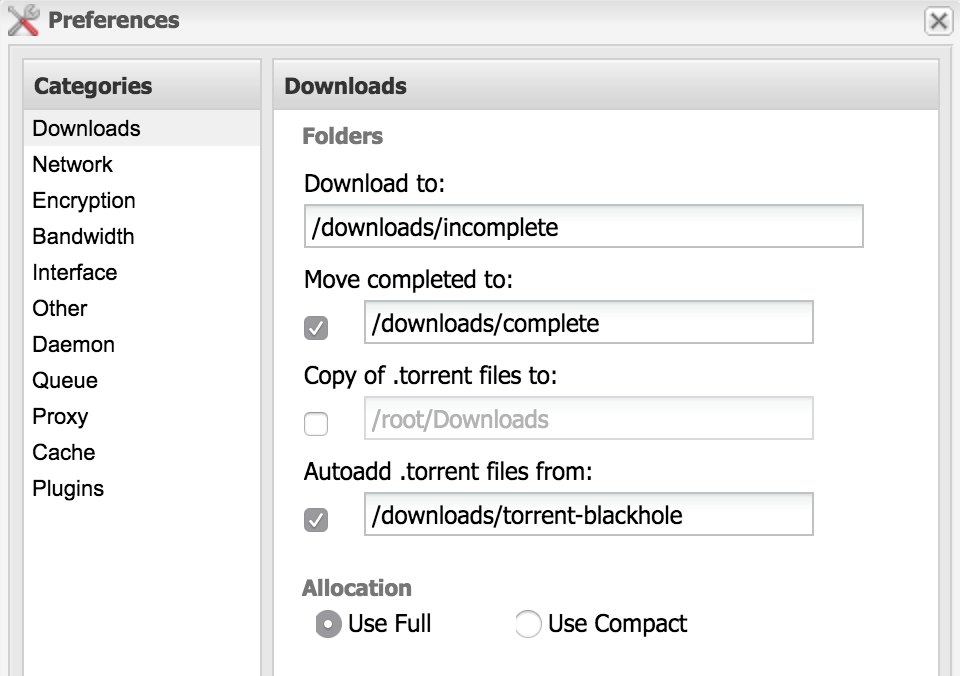

You can also tweak queue settings, defaults are fairly small. Also you can decide to stop seeding after a certain ratio is reached. That will be useful for Sonarr, since Sonarr can only remove finished downloads from deluge when the torrent has stopped seeding. Setting a very low ratio is not very fair though !

Configuration gets stored automatically in your mounted volume (`${ROOT}/config/deluge`) to be re-used at container restart. Important files in there:

- `auth` contains your login/password
- `core.conf` contains your deluge configuration

You can use the Web UI manually to download any torrent from a .torrent file or magnet hash.


### Setup Jackett

[Jackett](https://github.com/Jackett/Jackett) translates request from Sonarr and Radarr to searches for torrents on popular torrent websites, even though those website do not have a sandard common APIs (to be clear: it parses html for many of them :)).

#### Docker container

No surprise: let's use linuxserver.io container !

```yaml
jackett:
  container_name: jackett
  image: linuxserver/jackett:latest
  restart: unless-stopped
  network_mode: host
  environment:
    - PUID=${PUID} # default user id, defined in .env
    - PGID=${PGID} # default group id, defined in .env
    - TZ=${TZ} # timezone, defined in .env
  volumes:
    - /etc/localtime:/etc/localtime:ro
    - ${ROOT}/downloads/torrent-blackhole:/downloads # place where to put .torrent files for manual download
    - ${ROOT}/config/jackett:/config # config files
```

Nothing particular in this configuration, it's pretty similar to other linuxserver.io images.
An interesting setting is the torrent blackhole directory. When you do manual searches, Jackett will put `.torrent` files there, to be grabbed by your torrent client directly (Deluge for instance).

As usual, run with `docker-compose up -d`.

#### Configuration and usage

Jackett web UI is available on port 9117.

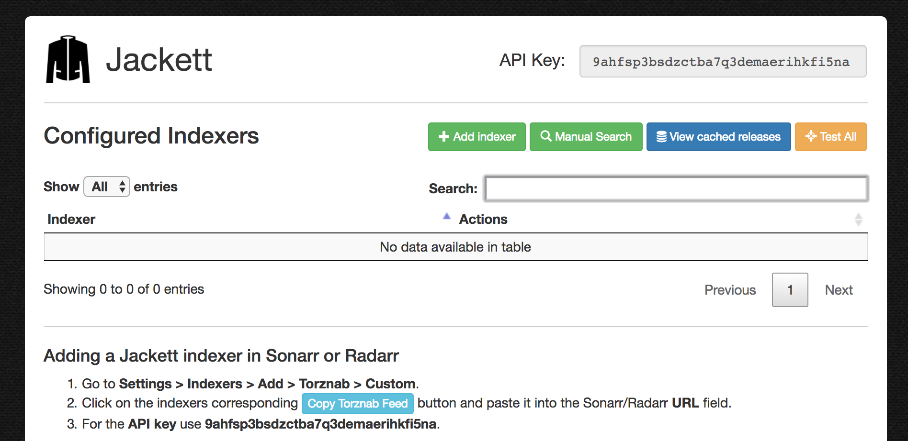

Configuration is available at the bottom of the page. I chose to disable auto-update (I'll rely on the docker images tags myself), and to set `/downloads` as my blackhole directory.

Click on `Add Indexer` and add any torrent indexer that you like. I added 1337x, cpasbien, RARBG, The Pirate Bay and YGGTorrent (need a user/password).

You can now perform a manual search across multiple torrent indexers in a clean interface with no trillion ads pop-up everywhere. Then choose to save the .torrent file to the configured blackhole directory, ready to be picked up by Deluge automatically !

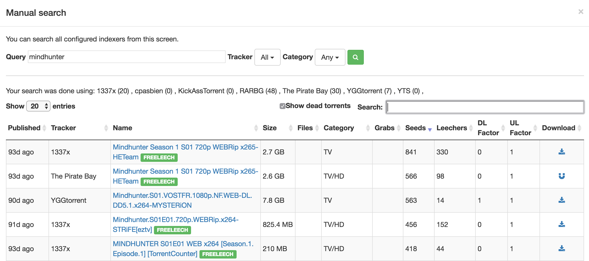

### Setup NZBGet

#### Docker container

Once again we'll use the Docker image from linuxserver and set it in a docker-compose file.

```yaml
  nzbget:
    container_name: nzbget
    image: linuxserver/nzbget:latest
    restart: unless-stopped
    network_mode: host
    environment:
      - PUID=${PUID} # default user id, defined in .env
      - PGID=${PGID} # default group id, defined in .env
      - TZ=${TZ} # timezone, defined in .env
     volumes:
      - ${ROOT}/downloads:/downloads # download folder
      - ${ROOT}/config/nzbget:/config # config files
```

#### Configuration and usage

After running the container, web UI should be available on `localhost:6789`.
Username: nzbget
Password: tegbzn6789

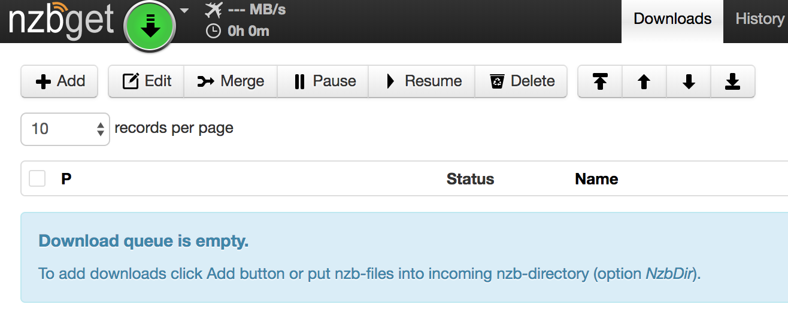

Since NZBGet stays on my local network, I choose to disable passwords (`Settings/Security/ControlPassword` set to empty).

The important thing to configure is the url and credentials of your newsgroups server (`Settings/News-servers`). I have a Frugal Usenet account at the moment, I set it up with TLS encryption enabled.

Default configuration suits me well, but don't hesitate to have a look at the `Paths` configuration.

You can manually add .nzb files to download, but the goal is of course to have Sonarr and Radarr take care of it automatically.


### Setup Sonarr

#### Docker container

Guess who made a nice Sonarr Docker image? Linuxserver.io !

Let's go:

```yaml
  sonarr:
    container_name: sonarr
    image: linuxserver/sonarr:latest
    restart: unless-stopped
    network_mode: host
    environment:
      - PUID=${PUID} # default user id, defined in .env
      - PGID=${PGID} # default group id, defined in .env
      - TZ=${TZ} # timezone, defined in .env
     volumes:
      - /etc/localtime:/etc/localtime:ro
      - ${ROOT}/config/sonarr:/config # config files
      - ${ROOT}/complete/tv:/tv # tv shows folder
      - ${ROOT}/downloads:/downloads # download folder
```

`docker-compose up -d`

Sonarr web UI listens on port 8989 by default. You need to mount your tv shows directory (the one where everything will be nicely sorted and named). And your download folder, because sonarr will look over there for completed downloads, then move them to the appropriate directory.

#### Configuration

Sonarr should be available on `localhost:8989`. Go straight to the `Settings` tab.

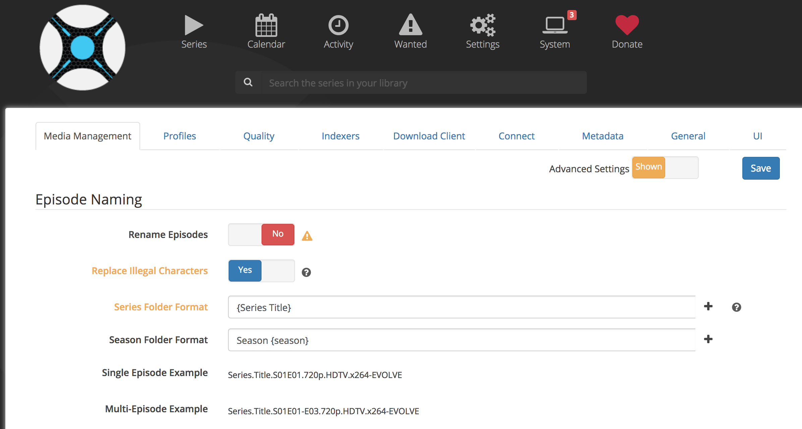

Enable `Ignore Deleted Episodes`: if like me you delete files once you have watched them, this makes sure the episodes won't be re-downloaded again.
In `Media Management`, you can choose to rename episodes automatically. This is a very nice feature I've been using for a long time.
In `profiles` you can set new quality profiles, default ones are fairly good. There is an important option at the bottom of the page: do you want to give priority to Usenet or Torrents for downloading episodes? I'm keeping the default Usenet first.

`Indexers` is the important tab: that's where Sonarr will grab information about released episodes. Nowadays a lot of Usenet indexers are relying on Newznab protocol: fill-in the URL and API key you are using. You can find some indexers on this [subreddit wiki](https://www.reddit.com/r/usenet/wiki/indexers). It's nice to use several ones since there are quite volatile. You can find suggestions on Sonarr Newznab presets. Some of these indexers provide free accounts with a limited number of API calls, you'll have to pay to get more. Usenet-crawler is one of the best free indexers out there.

For torrents indexers, I activate Torznab custom indexers that point to my local Jackett service. This allows searches across all torrent indexers configured in Jackett. You have to configure them one by one though.

Get torrent indexers Jackett proxy URLs by clicking `Copy Torznab Feed` in Jackett Web UI. Use the global Jackett API key as authentication.


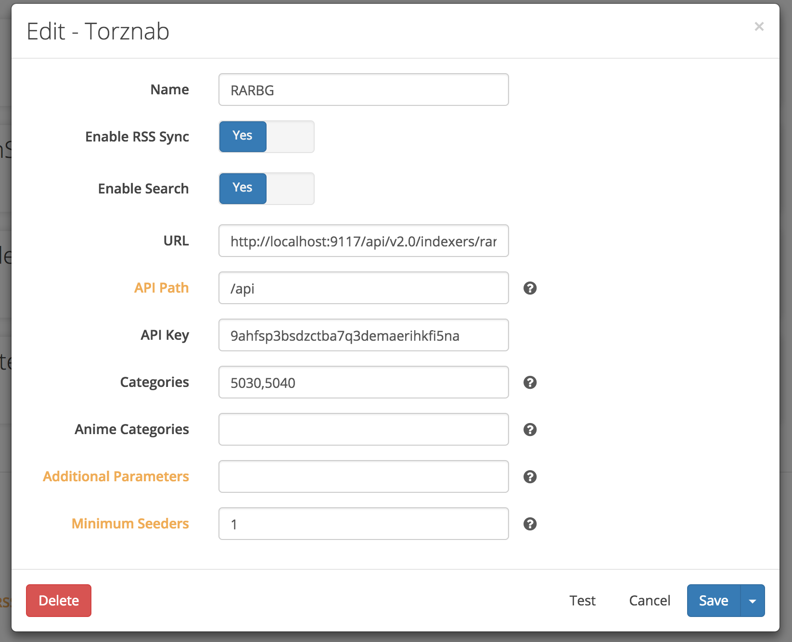

`Download Clients` tab is where we'll configure links with our two download clients: NZBGet and Deluge.
There are existing presets for these 2 that we'll fill with the proper configuration.

NZBGet configuration:
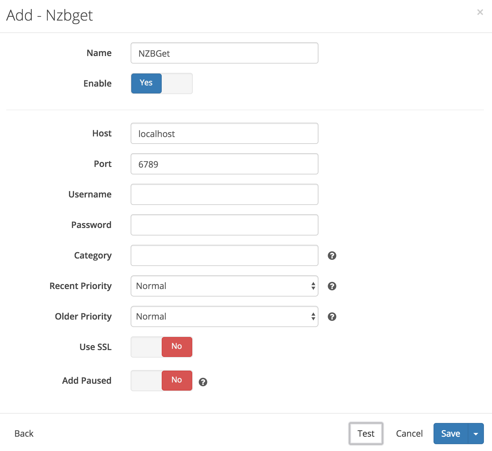

Deluge configuration:
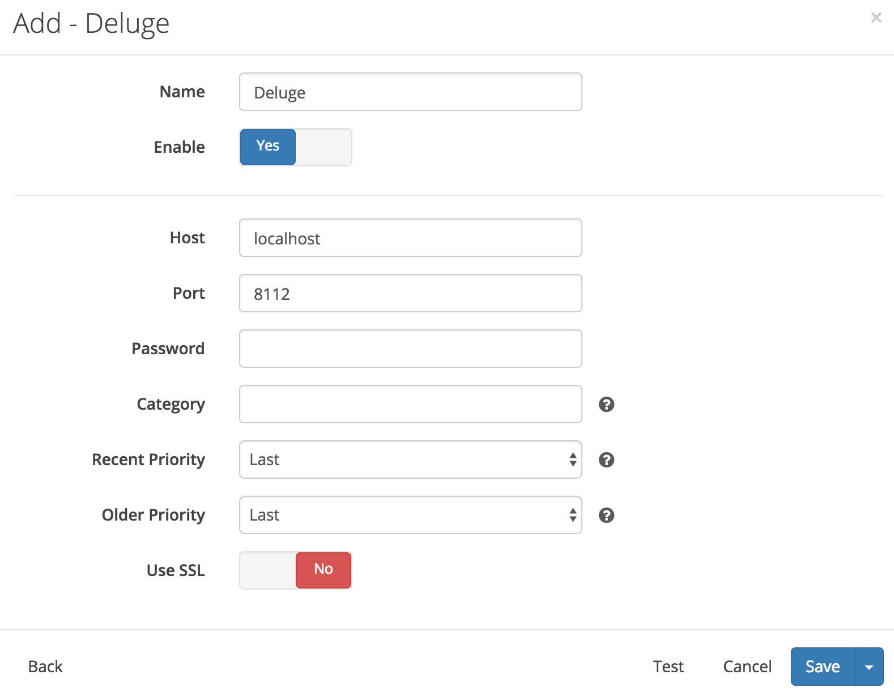

Enable `Advanced Settings`, and tick `Remove` in the Completed Download Handling section. This tells Sonarr to remove torrents from deluge once processed.

In `Connect` tab, we'll configure Sonarr to send notifications to Plex when a new episode is ready:
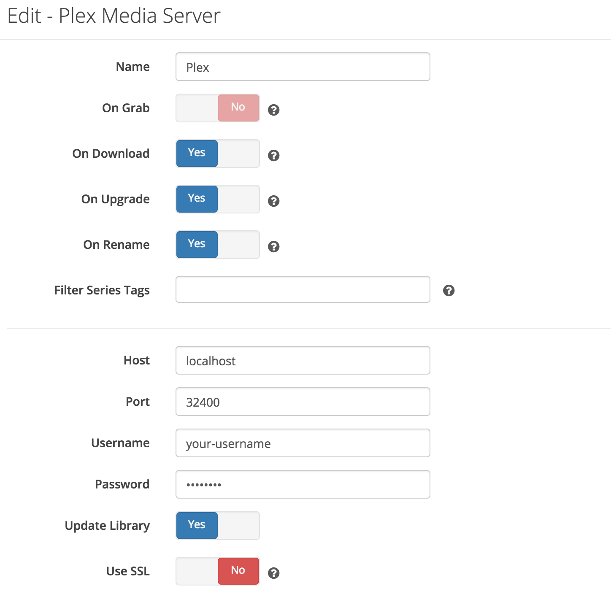

#### Give it a try

Let's add a series !

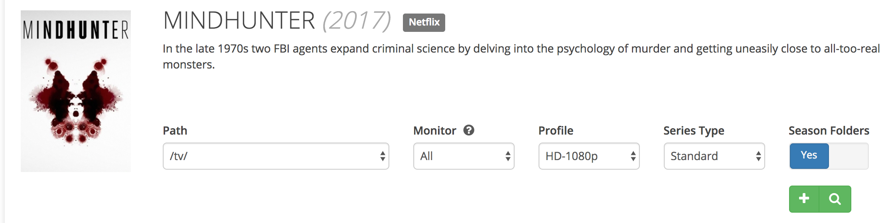

_Note: You may need to `chown -R $USER:$USER /path/to/root/directory` so Sonarr and the rest of the apps have the proper permissions to modify and move around files. This Docker image of Sonarr uses an internal user account inside the container called `abc` some you may have to set this user as owner of the directory where it will place the media files after download. This note also applies for Radarr._

Enter the series name, then you can choose a few things:

- Monitor: what episodes do you want to mark as monitored? All future episodes, all episodes from all seasons, only latest seasons, nothing? Monitored episodes are the episodes Sonarr will download automatically.
- Profile: quality profile of the episodes you want (HD-1080p is the most popular I guess).

You can then either add the serie to the library (monitored episode research will start asynchronously), or add and force the search.

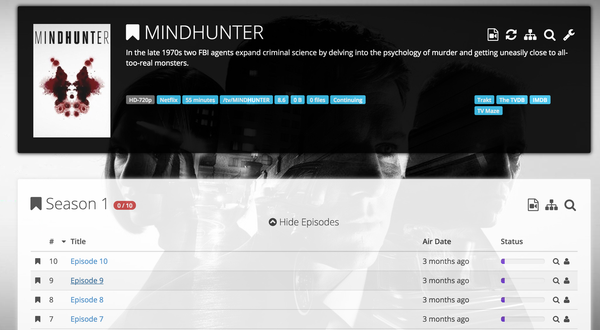

Wait a few seconds, then you should see that Sonarr started doing its job. Here it grabed files from my Usenet indexers and sent the download to NZBGet automatically.

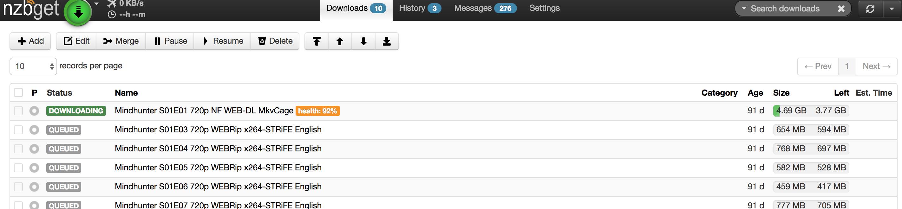

You can also do a manual search for each episode, or trigger an automatic search.

When download is over, you can head over to Plex and see that the episode appeared correctly, with all metadata and subtitles grabbed automatically. Applause !

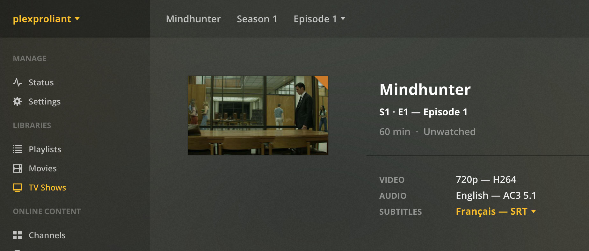

### Setup Radarr

Radarr is a fork of Sonarr, made for movies instead of TV shows. For a good while I've used CouchPotato for that exact purpose, but have not been really happy with the results. Radarr intends to be as good as Sonarr !

#### Docker container

Radarr is _very_ similar to Sonarr. You won't be surprised by this configuration.

```yaml
  radarr:
    container_name: radarr
    image: linuxserver/radarr:latest
    restart: unless-stopped
    network_mode: host
    environment:
      - PUID=${PUID} # default user id, defined in .env
      - PGID=${PGID} # default group id, defined in .env
      - TZ=${TZ} # timezone, defined in .env
     volumes:
      - /etc/localtime:/etc/localtime:ro
      - ${ROOT}/config/radarr:/config # config files
      - ${ROOT}/complete/movies:/movies # movies folder
      - ${ROOT}/downloads:/downloads # download folder
```

#### Configuration

Radarr Web UI is available on port 7878.
Let's go straight to the `Settings` section.

In `Media Management`, you can choose whether or not to enable automatic renaming. Previously I used the sub-zero plugin to find subtitles which functioned better with the original filenames. But now with Bazarr, it's hooked directly into Radarr and Sonarr which means it will look at the original filenames anyway. I enable `Ignore Deleted Movies` to make sure movies that I delete won't be downloaded again by Radarr. I disable `Use Hardlinks instead of Copy` because I prefer to avoid messing around what's in my download area and what's in my movies area.

In `Profiles` you can set new quality profiles, default ones are fairly good. There is an important option at the bottom of the page: do you want to give priority to Usenet or Torrents for downloading episodes? I'm keeping the default Usenet first.

As for Sonarr, the `Indexers` section is where you'll configure your torrent and nzb sources.

Nowadays a lot of Usenet indexers are relying on Newznab protocol: fill-in the URL and API key you are using. You can find some indexers on this [subreddit wiki](https://www.reddit.com/r/usenet/wiki/indexers). It's nice to use several ones since there are quite volatile. You can find suggestions on Radarr Newznab presets. Some of these indexers provide free accounts with a limited number of API calls, you'll have to pay to get more. Usenet-crawler is one of the best free indexers out there.
For torrents indexers, I activate Torznab custom indexers that point to my local Jackett service. This allows searches across all torrent indexers configured in Jackett. You have to configure them one by one though.

Get torrent indexers Jackett proxy URLs by clicking `Copy Torznab Feed`. Use the global Jackett API key as authentication.


`Download Clients` tab is where we'll configure links with our two download clients: NZBGet and Deluge.
There are existing presets for these 2 that we'll fill with the proper configuration.

NZBGet configuration:


Deluge configuration:


Enable `Advanced Settings`, and tick `Remove` in the Completed Download Handling section. This tells Radarr to remove torrents from deluge once processed.

In `Connect` tab, we'll configure Radarr to send notifications to Plex when a new episode is ready:


#### Give it a try

Let's add a movie !

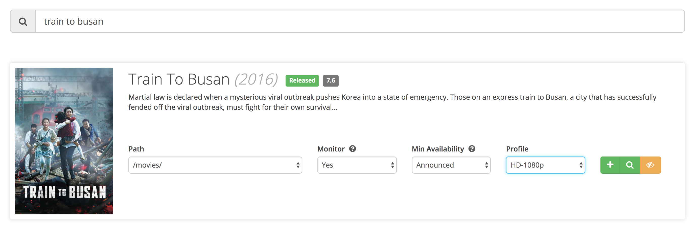

Enter the movie name, choose the quality you want, and there you go.

You can then either add the movie to the library (monitored movie research will start asynchronously), or add and force the search.

Wait a few seconds, then you should see that Radarr started doing its job. Here it grabed files from my Usenet indexers and sent the download to NZBGet automatically.

You can also do a manual search for each movie, or trigger an automatic search.

When download is over, you can head over to Plex and see that the movie appeared correctly, with all metadata and subtitles grabbed automatically. Applause !

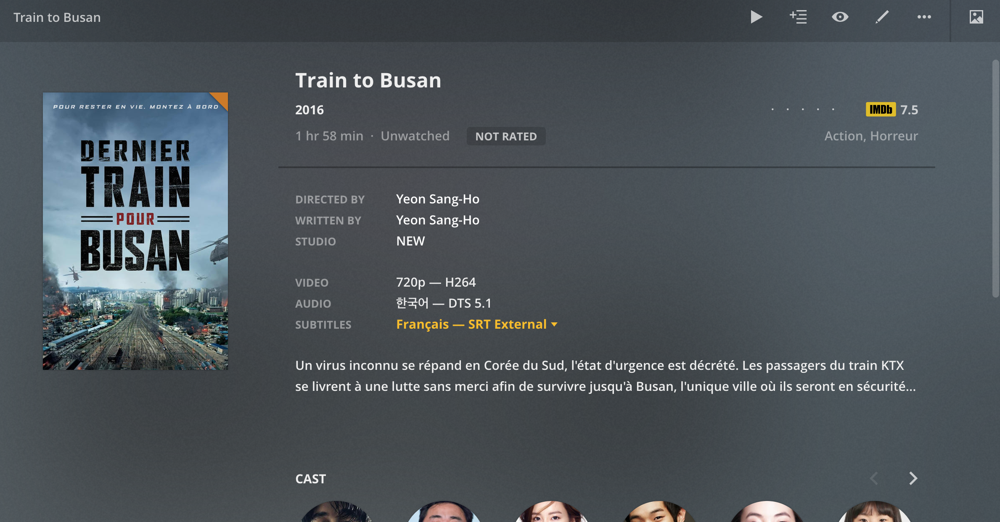

#### Movie discovering

I like the discovering feature. When clicking on `Add Movies` you can select `Discover New Movies`, then browse through a list of TheMovieDB recommended or popular movies.

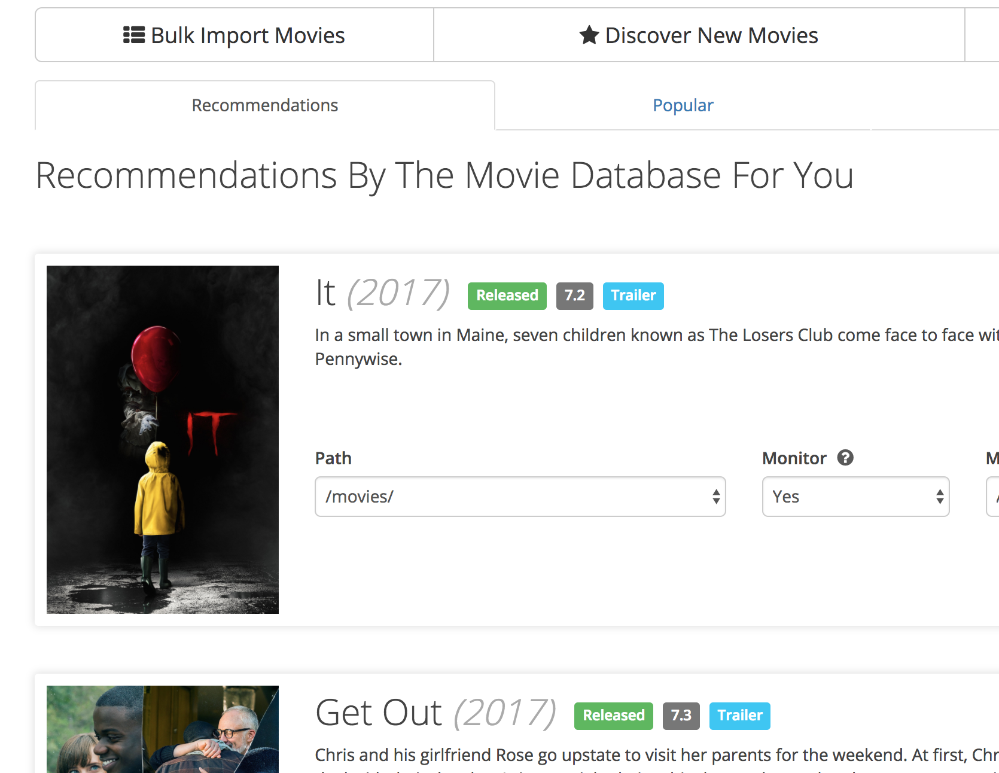

On the rightmost tab, you'll also see that you can setup Lists of movies. What if you could have in there a list of the 250 greatest movies of all time and just one-click download the ones you want?

This can be set up in `Settings/Lists`. I activated the following lists:

- StevenLu: that's an [interesting project](https://github.com/sjlu/popular-movies) that tries to determine by certain heuristics the current popular movies.
- IMDB TOP 250 movies of all times from Radarr Lists presets
- Trakt Lists Trending and Popular movies

I disabled automatic sync for these lists: I want them to show when I add a new movie, but I don't want every item of these lists to be automatically synced with my movie library.

### Setup Bazarr

In previous versions of this guide, I used the sub-zero plugin for plex. Based on someone's suggestion on this project I tried out [Bazarr](https://www.bazarr.media/) which hooks directly into Radarr and Sonarr and makes the process more effective and painless. If you don't care about subtitles go ahead and skip this step.

#### Bazarr Docker container

Believe it or not, we will be using yet another docker container from linuxserver! Since this is made to be a companion app for Sonarr and Radarr, you will notice that the configuration is very similar to them, just point it at the directories where you store your organized movies and tv shows.

```yaml
bazarr:
  container_name: bazarr
  image: linuxserver/bazarr
  restart: unless-stopped
  network_mode: host
  environment:
    - PUID=${PUID} # default user id, defined in .env
    - PGID=${PGID} # default group id, defined in .env
    - TZ=${TV} # timezone, defined in .env
    - UMASK_SET=022 #optional
  volumes:
    - ${ROOT}/config/bazarr:/config # config files
    - ${ROOT}/complete/movies:/movies # movies folder
    - ${ROOT}/complete/tv:/tv # tv shows folder
  ports:
    - 6767:6767
```

#### Bazarr Configuration

The Web UI for Bazarr will be available on port 6767. Load it up and you will be greeted with this setup page:

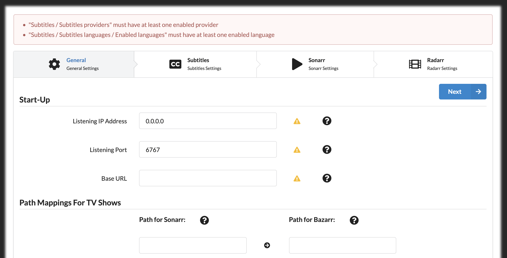

You can leave this page blank and go straight to the next page, "Subtitles". There are many options for different subtitle providers to use, but in this guide I'll be using [Open Subtitles](https://www.opensubtitles.org/). If you don't have an account with them, head on over to the [Registration page](https://www.opensubtitles.org/en/newuser) and make a new account. Then all you need to do is tick the box for OpenSubtitles and fill in your new account details.

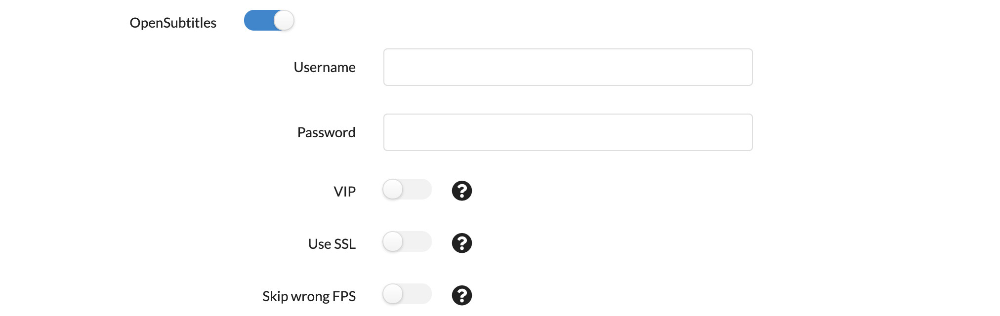

You can always add more subtitle providers if you want, figure out which ones are good for you!

Next scroll to the bottom of the screen where you will find your language settings. I am interested in French as well as English subtitles so I will add both of them for enabled languages. However I am primarily interested in French so I will turn on "Default Enabled" for both TV and movies and finally set French to be that default.

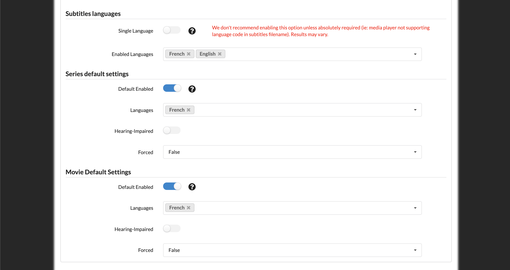

Click next and we will be on the Sonarr setup page. For this part we will need our Sonarr API key. To get this, open up sonarr in a separate tab and navigate to `Settings > General > Security` and copy the api key listed there.

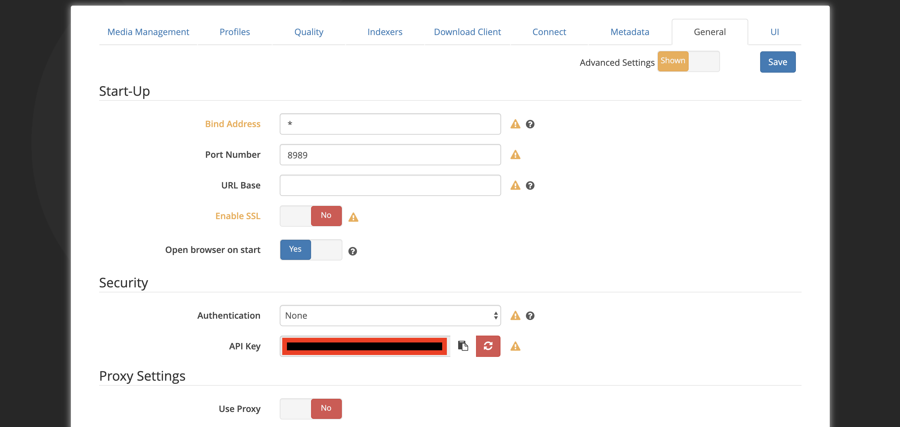

Head back over Bazarr and check the "Use Sonarr" box and some settings will pop up. Paste your API key in the proper field, and you can leave the other options default. If you would like, you can tick the box for "Download Only Monitored" which will prevent Bazarr from downloading subtitles for tv shows you have in your Sonarr library but have possibly deleted from your drive. Then click "Test" and Sonarr should be all set!

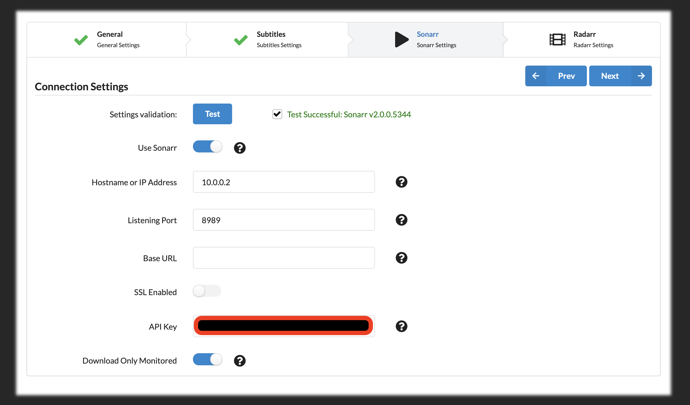

The next step is connecting to Radarr and the process should be identical. The only difference is that you'll have to grab your Radarr API key instead of Sonarr. Once that's done click Finish and you will be brought to your main screen where you will be greeted with a message saying that you need to restart. Click this and Bazarr should reload. Once that's all set, you should be good to go! Bazarr should now automatically downlaod subtitles for the content you add through Radarr and Sonarr that is not already found within the media files themselves.

If you have any problems, check out the [wiki page](https://github.com/morpheus65535/bazarr/wiki/First-time-installation-configuration) for Bazarr and you should probably find your answer.

## Manage it all from your mobile

On Android, I'm using [nzb360](http://nzb360.com) to manage NZBGet, Deluge, Sonarr and Radarr.
It's a beautiful and well-thinked app. Easy to get a look at upcoming tv shows releases (eg. "when will the next f\*\*cking Game of Thrones episode be released?").

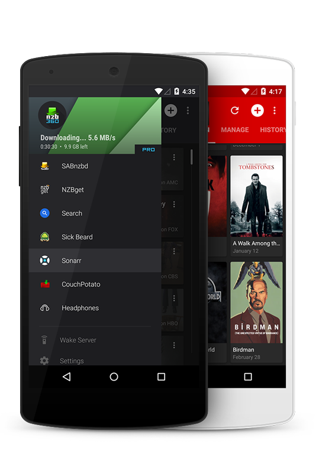

The free version does not allow you to add new shows. Consider switching to the paid version (6\$) and support the developer.

## Going Further

Some stuff worth looking at that I do not use at the moment:

- [NZBHydra](https://github.com/theotherp/nzbhydra): meta search for NZB indexers (like [Jackett](https://github.com/Jackett/Jackett) does for torrents). Could simplify and centralise nzb indexers configuration at a single place.
- [Organizr](https://github.com/causefx/Organizr): Embed all these services in a single webpage with tab-based navigation
- [Plex sharing features](https://www.plex.tv/features/#feat-modal)
- [Headphones](https://github.com/rembo10/headphones): Automated music download. Like Sonarr but for music albums. I've been using it for a while, but it did not give me satisfying results. I also tend to rely entirely on a Spotify premium account to manage my music collection now.
- [Mylar](https://github.com/evilhero/mylar): like Sonarr, but for comic books.
- [Ombi](http://www.ombi.io/): Web UI to give your shared Plex instance users the ability to request new content
- [PlexPy](https://github.com/JonnyWong16/plexpy): Monitoring interface for Plex. Useful is you share your Plex server to multiple users.
- Radarr lists automated downloads, to fetch best movies automatically. [Rotten Tomatoes certified movies](https://www.rottentomatoes.com/browse/cf-in-theaters/) would be a nice list to parse and get automatically.
